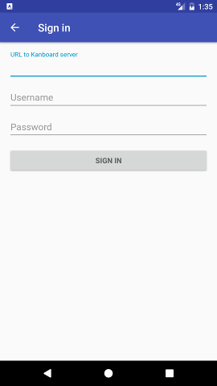
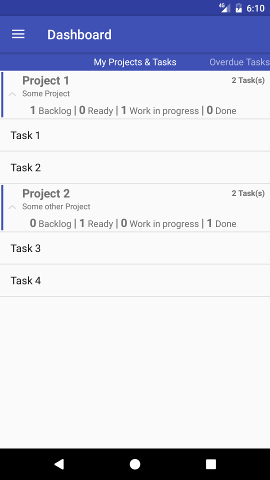
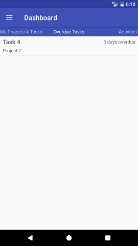
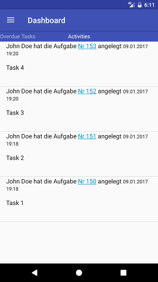
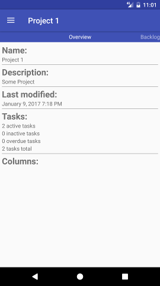
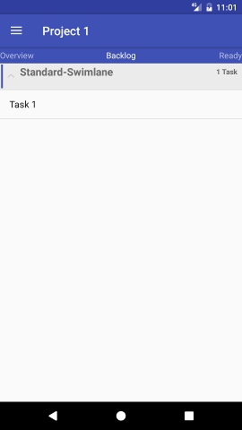
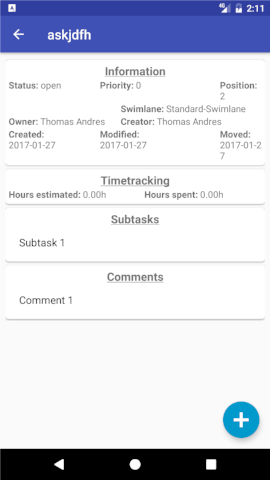
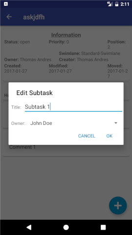

# Kandroid
Android App for [Kanboard](https://kanboard.net/).










## Install
Download the latest release from github

or

build it with Android Studio  
```
git clone https://github.com/andresth/Kandroid.git
cd Kandroid
./gradlew
```

## Usage
Login to your Kanboard instance with your user credentials.

## Requirements
Kanboard Version 1.0.38 or higher installed at a web server.  
You can find the download at https://kanboard.net/
